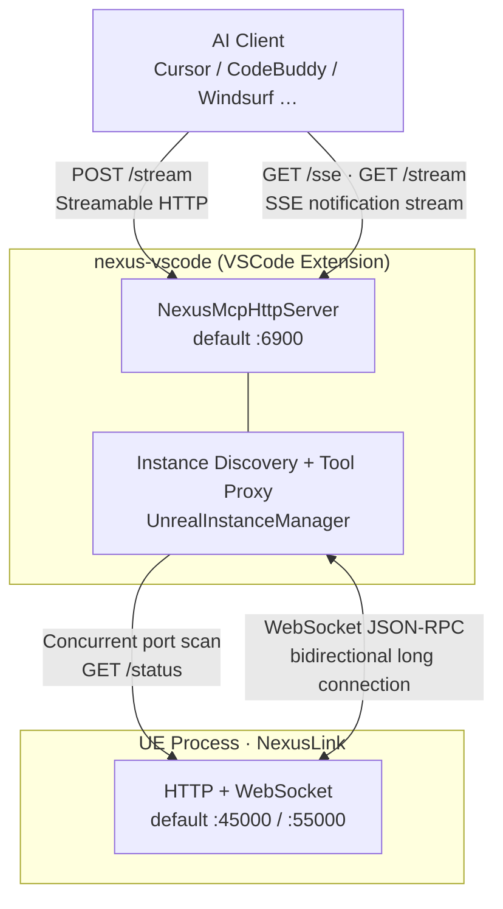
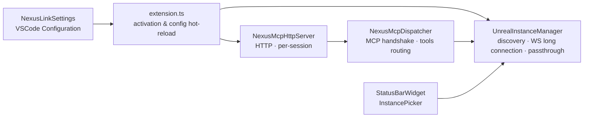
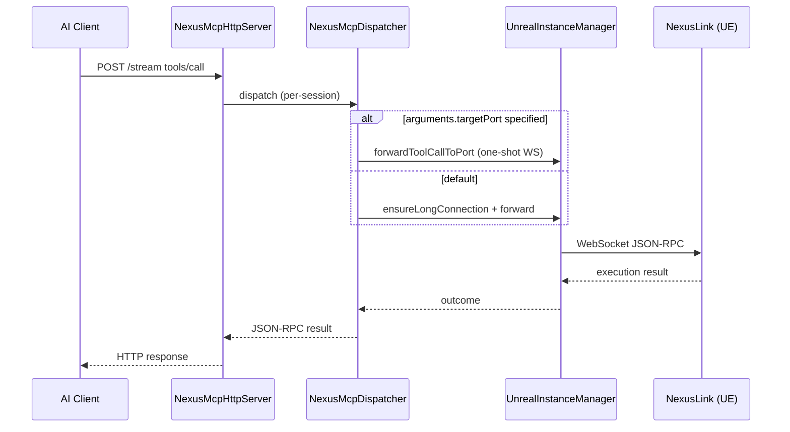

**Language / Language**: [简体中文](README.md) · **English**

# nexus-vscode — VSCode / Cursor MCP Proxy Extension

VSCode / Cursor MCP **proxy** extension: runs a standalone MCP HTTP server locally (default `:6900`), auto-discovers UE instances, and forwards AI tool calls to the **NexusLink** UE plugin over WebSocket. Blueprints, assets, PIE, and other capabilities are provided by NexusLink on the UE side; this extension does not implement game logic.

---

## What Is This

| Access mode | Endpoint | Best for |
|-------------|----------|----------|
| **VSCode proxy** (this extension) | `http://127.0.0.1:6900/stream` | VSCode / Cursor / CodeBuddy users; auto-discover/switch among multiple UE instances |
| Rider proxy | `http://127.0.0.1:6800/stream` | JetBrains Rider users (see [NexusRider](https://github.com/bytepine/NexusRider)) |
| Direct UE | `http://127.0.0.1:45000/stream` | No IDE plugin needed; you must specify the UE port yourself |

Why use a proxy: AI clients connect to a fixed port; the extension scans `45000`–`45100`, maintains WebSocket long connections, and switches among multiple Editor / PIE instances.

---

## Dependencies & Version Compatibility

| Component | Requirement |
|-----------|-------------|
| **nexus-vscode** | Aligned with UE `proxy_config.minProxyVersion`; use the latest version |
| **NexusLink** (UE plugin) | `nexus-mcp-unreal-*.zip` from [NexusLink Releases](https://github.com/bytepine/NexusLink/releases); UE **4.26+** |
| **VSCode / Cursor** | VS Code Engine **^1.85.0** |
| **Node.js** (local build only) | 20+ |

NexusLink install: extract the zip into your UE project’s `Plugins/Developer/NexusLink` and enable the plugin in the editor. See [UE prerequisites](#1-ue-prerequisites) below.

---

## Getting Releases

| Channel | Notes |
|---------|-------|
| **Extension marketplace** (recommended) | Search **Nexus MCP** in the Extensions panel of VSCode / Cursor / CodeBuddy / Windsurf (served via [Open VSX](https://open-vsx.org/extension/byteyang/nexus-mcp-vscode)) |
| `nexus-mcp-vscode-<version>.vsix` | Download from [NexusVSCode Releases](https://github.com/bytepine/NexusVSCode/releases) and install manually |
| `nexus-mcp-unreal-<version>.zip` (NexusLink UE plugin) | [NexusLink Releases](https://github.com/bytepine/NexusLink/releases) |

You can also [build locally](#local-build-and-development) to produce a `.vsix` and install via **Extensions: Install from VSIX...**.

---

## Architecture Overview



**Data path**: AI clients connect to the VSCode proxy over MCP HTTP; the proxy connects to UE over WebSocket JSON-RPC, avoiding MCP handshake overhead on the UE side. UE must enable the MCP server in Editor Preferences before it can be discovered.

### Internal Components



| Component | Responsibility |
|-----------|----------------|
| `extension.ts` | Extension activation (`onStartupFinished`); start/stop by `nexusMcp.enabled`; config hot-reload |
| `NexusMcpHttpServer` | HTTP MCP server; `POST /stream` + `GET /sse`/`/stream`; per-session isolation via `Mcp-Session-Id` |
| `NexusMcpDispatcher` | JSON-RPC 2.0 parsing; `initialize` → `initialized` → `tools/list` / `tools/call` |
| `UnrealInstanceManager` | Port-scan discovery; WebSocket long connection; `list_unreal_instances` / `connect_unreal_instance`; remote tool passthrough |
| `proxyConfig` | Caches UE `nexus/proxy_config`; drives connection-tool copy and `initialize.instructions` |

### Tool Call Flow



---

## Installation & Usage

> **Master switch required**: The extension auto-activates after VSCode/Cursor startup (`onStartupFinished`), but the MCP HTTP server is **off by default**. Set `nexusMcp.enabled` to `true` in **Settings** (see [Install extension](#2-install-extension) below) before it listens on a port; set to `false` to stop immediately, or back to `true` for hot start without reloading the window.

### 1. UE Prerequisites

NexusLink MCP HTTP/WebSocket is **off by default** and must be enabled manually in UE:

1. Download `nexus-mcp-unreal-*.zip` from [NexusLink Releases](https://github.com/bytepine/NexusLink/releases) and extract to `Plugins/Developer/NexusLink`
2. **Edit → Plugins → Developer → NexusLink** — enable the plugin and restart the editor
3. **Edit → Editor Preferences → Plugins → NexusLink** — check **Enable MCP Server**
4. Takes effect immediately after save; toolbar/settings panel shows actual HTTP port (default `45000`) and WebSocket port (default `55000`)

If unchecked, the extension finds no instances and the status bar shows disconnected.

### 2. Install Extension

**Option A — Extension marketplace (recommended)**: search **Nexus MCP** in the Extensions panel of VSCode / Cursor / CodeBuddy / Windsurf and install.

**Option B — Manual vsix**:

1. Download `nexus-mcp-vscode-<version>.vsix` from [NexusVSCode Releases](https://github.com/bytepine/NexusVSCode/releases), or [build locally](#local-build-and-development)
2. VSCode / Cursor → **Extensions: Install from VSIX...** → select the `.vsix`
3. Reload the window

After install: **Settings** → search `nexusMcp` → set **Nexus Mcp: Enabled** to `true` (off by default; starts immediately on enable, default port `6900`).

### 3. Configuration

Entry: **Settings** → search `nexusMcp`

| Key | Default | Description |
|-----|---------|-------------|
| `nexusMcp.enabled` | `false` | Master switch; `true` starts immediately, `false` stops immediately, no window reload needed |
| `nexusMcp.httpPort` | `6900` | Port for AI clients; changing requires reload or toggling `enabled` |
| `nexusMcp.scanPortStart` | `45000` | UE instance scan start port |
| `nexusMcp.scanPortEnd` | `45100` | UE instance scan end port |
| `nexusMcp.scanIntervalSeconds` | `5` | Periodic discovery interval (seconds) |

### 4. Status Bar & Command Palette

**Status bar**: Shows UE connection state (project name / disconnected); click to switch instances.

**Command palette** (`Ctrl+Shift+P`):

| Command | Description |
|---------|-------------|
| `Nexus MCP: Refresh UE Instances` | Manually trigger port scan |
| `Nexus MCP: Select UE Instance` | Open instance list and connect |
| `Nexus MCP: Disconnect UE` | Disconnect current WebSocket |
| `Nexus MCP: Copy MCP Client Configuration` | Copy AI client JSON to clipboard |

### 5. UE Instance Discovery

- **Strategy**: Concurrent scan of configured port range; `GET /status` per port to verify liveness and read project name, `netRole`, etc.
- **Auto-connect**: Single instance connects automatically; with multiple instances, prefer `netRole=Editor`; switch manually via status bar or command palette
- **Preferred port**: After manual selection, `preferredPort` is remembered and restored on reconnect/rescan
- **Steady-state optimization**: While long connection is alive, most rounds only heartbeat the current port; full scan every 6 rounds
- **Disconnect handling**: Immediate async rescan; no `tools/list_changed` broadcast, but tool list cache is kept; list refreshes on reconnect or MCP session `initialized`

---

## Proxy Tools Reference

Besides remote UE tools, the proxy layer provides 2 local tools (names and schema can be overridden by UE `proxy_config`; fallback below when disconnected).

### `list_unreal_instances`

Discover all active UE instances in the current scan range.

**Parameters**: none (`inputSchema`: empty object)

**Returns** (`content[0].text` is a JSON array):

| Field | Type | Description |
|-------|------|-------------|
| `port` | int | UE HTTP port (use this value for `connect`) |
| `projectName` | string | Project name |
| `engineVersion` | string | Engine version |
| `netRole` | string | `Editor` / `DedicatedServer` / `ListenServer` / `Client` / `Standalone` |
| `connected` | bool | Whether this is the current long-connection target and WS is still OPEN |

### `connect_unreal_instance`

Connect to the UE instance on the given port and set it as `preferredPort`.

**Parameters**:

```json
{ "port": 45000 }
```

### Remote Tools & `targetPort`

`tools/list` merges the UE tool list when connected. `tools/call` forwards to the bound instance over the long connection by default (timeout **120s**).

For concurrent queries across instances, add `targetPort` in `arguments` for a one-shot WebSocket without changing the long-connection binding:

```json
{
  "name": "call_capability",
  "arguments": {
    "targetPort": 45001,
    "capability": "get_editor_context",
    "arguments": {}
  }
}
```

---

## Feature List

### Standalone MCP Server (for AI Clients)

- [x] Standalone MCP HTTP server (`POST /stream` Streamable HTTP + `GET /sse`/`/stream` SSE notification stream)
- [x] Dual protocol: legacy MCP SSE transport (2024-11-05) and Streamable HTTP (2025-03-26); negotiated version `2025-06-18`
- [x] JSON-RPC 2.0 + MCP session state machine (initialize/initialized/ping/tools)
- [x] Per-session isolation (`Mcp-Session-Id` header); multiple AI clients can connect concurrently without interference
- [x] Configurable listen port (default 6900); auto-increment on conflict (up to 100 subsequent ports)

### UE Instance Discovery & Management

- [x] Port scan + `GET /status` liveness check (no stale dead processes)
- [x] Background periodic rediscovery (default every 5 seconds)
- [x] WebSocket long connection (JSON-RPC, no MCP handshake overhead)
- [x] Multi-instance: list all discovered UE instances with project info
- [x] `preferredPort` preserves manual user selection
- [x] Tool list cache during disconnect to avoid AI clients downgrading `tools/call` to Tool not found

### IDE Integration

- [x] VSCode settings (`nexusMcp.*`): master switch, port and scan configuration
- [x] Status bar: real-time UE connection state; click to switch instances
- [x] Command palette: refresh instances, select instance, disconnect, copy MCP config
- [x] Hot `enabled` toggle without restarting VSCode
- [x] Auto-push `notifications/tools/list_changed` on UE connect/disconnect

### MCP Tool Proxy

- [x] `list_unreal_instances` / `connect_unreal_instance` — see [Proxy tools reference](#proxy-tools-reference)
- [x] `initialize.instructions` — after connect, async fetch of UE `nexus/instructions`; append `InitializeInstructions.*.md` to handshake response
- [x] Connection-tool copy from UE `nexus/proxy_config` (`ProxyConfig.json`); generic fallback when disconnected
- [x] Remote tool passthrough: `tools/list` merges UE tools; `tools/call` forwards over long connection by default; `arguments.targetPort` uses one-shot WS

---

## AI Client Configuration

Enable `nexusMcp.enabled` first (see [Install extension](#2-install-extension)); the MCP server listens only then. Default endpoint `http://127.0.0.1:6900/stream`. If the MCP port is taken, the extension auto-increments — use the actual port from the startup notification. Or use command palette **Nexus MCP: Copy MCP Client Configuration** to copy in one click.

**Cursor** (`~/.cursor/mcp.json`, Streamable HTTP):

```json
{
  "mcpServers": {
    "nexus-vscode": {
      "url": "http://127.0.0.1:6900/stream"
    }
  }
}
```

**CodeBuddy / Windsurf** (Streamable HTTP):

```json
"Nexus": {
  "url": "http://127.0.0.1:6900/stream",
  "transportType": "streamable-http",
  "description": "NexusLink MCP Server for Unreal Engine",
  "disabled": false
}
```

**SSE transport** (legacy MCP clients):

```json
"nexus-vscode": {
  "url": "http://127.0.0.1:6900/sse"
}
```

---

## Local Build & Development

### Package the Extension

```bash
py scripts/build_vscode.py --version <version> --output release/
```

Or manually:

```bash
npm ci && npm run build
npx vsce package --no-dependencies
```

Output: `release/nexus-mcp-vscode-<version>.vsix` or `*.vsix` in the current directory.

### Development & Debugging

```bash
npm ci
npm run watch    # esbuild watch mode
```

Press **F5** in VSCode to launch Extension Development Host.

Source: `src/` (entry `extension.ts`)

Update the `[Unreleased]` section in [CHANGELOG.md](CHANGELOG.md) for feature changes.

---

## Tech Stack

| Category | Choice |
|----------|--------|
| Language | TypeScript |
| Runtime | Node.js 20+ |
| MCP HTTP | Custom HTTP server (Streamable HTTP + SSE) |
| UE communication | `ws` WebSocket client |
| Build | esbuild + `@vscode/vsce` |

---

## FAQ

### AI client shows “MCP initialization timeout”

- Confirm `nexusMcp.enabled` is `true`
- Confirm UE has **Enable MCP Server** checked and NexusLink plugin is loaded
- Check that the AI client port matches the extension’s actual listen port (default `6900`)
- Confirm the status bar shows a connected UE project name

### Multiple AI clients at once

Per-session isolation (`Mcp-Session-Id` header) is supported. Multiple AI clients can connect to the same MCP server concurrently without interference.

### Multiple UE instances running

Each UE instance gets a different port automatically. The extension discovers all instances; pick the target in the status bar or command palette. For concurrent multi-instance queries, see [targetPort example](#remote-tools-and-targetport).

### Tool list does not refresh

The proxy pushes `notifications/tools/list_changed` on UE connect/disconnect. If the AI client does not update, reconnect MCP or restart the AI session; the proxy warms `tools/list` on `initialized` and may resend the notification.

### View logs

VSCode: **Help → Toggle Developer Tools** → Console, search for `Nexus MCP`.

### UE assets changed but disk files did not

This is NexusLink / UE behavior (e.g. `save_asset` persistence), not this proxy.

---

## Changelog

See [CHANGELOG.md](CHANGELOG.md).

---

## License

[MIT](LICENSE) © byteyang
